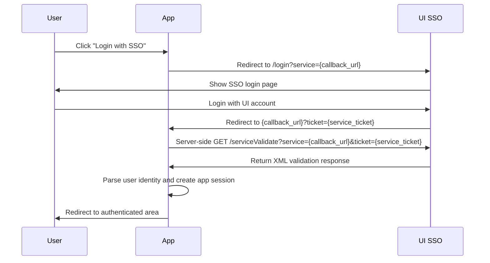

# UI SSO Integration Documentation

This document explains how to integrate an application with Universitas Indonesia SSO using a stack-agnostic CAS-style flow.

## 1. Overview

UI SSO provides centralized authentication for users. The application does not collect the user's SSO password. Instead, the application redirects the user to the SSO login page, receives a temporary `ticket`, validates that ticket with the SSO server, and then creates its own application session.

## 2. SSO Configuration

| Item                       | Value                                             |
| -------------------------- | ------------------------------------------------- |
| SSO Base URL               | `https://sso.ui.ac.id/cas2`                       |
| Login Endpoint             | `https://sso.ui.ac.id/cas2/login`                 |
| Ticket Validation Endpoint | `https://sso.ui.ac.id/cas2/serviceValidate`       |
| Logout Endpoint            | `https://sso.ui.ac.id/cas2/logout`                |
| Protocol Style             | CAS 2.0-style login and service ticket validation |

Recommended environment variables:

```env
SSO_BASE_URL="https://sso.ui.ac.id/cas2"
APP_BASE_URL="https://your-app.example.com"
SSO_CALLBACK_URL="https://your-app.example.com/auth/sso/callback"
```

For local development, the callback URL can point to localhost only if it is accepted by the SSO provider or exposed through a secure tunnel.

## 3. Terms

| Term                | Meaning                                                                                                                                                |
| ------------------- | ------------------------------------------------------------------------------------------------------------------------------------------------------ |
| Service URL         | The application callback URL that receives the SSO `ticket`.                                                                                           |
| Ticket              | A temporary one-time credential returned by SSO after the user logs in.                                                                                |
| Callback Route      | The application endpoint that receives `?ticket=...`.                                                                                                  |
| Application Session | The app's own session after the SSO ticket is validated. This can be a server session, signed cookie, JWT cookie, or another secure session mechanism. |

## 4. Authentication Flow



## 5. Required Application Routes

Your application should expose at least these routes:

| Route                                     | Purpose                                                                 |
| ----------------------------------------- | ----------------------------------------------------------------------- |
| `GET /auth/sso/login`                     | Starts the SSO login flow.                                              |
| `GET /auth/sso/callback`                  | Receives the SSO `ticket`, validates it, and creates the local session. |
| `POST /auth/logout` or `GET /auth/logout` | Clears the local session and optionally redirects to SSO logout.        |

Route names are examples only. You can use any route structure as long as the `service` URL is consistent.

## 6. Step-by-Step Integration

### Step 1 — Define the Service URL

The service URL is the callback URL in your application.

Example:

```text
https://your-app.example.com/auth/sso/callback
```

This exact URL must be used both when redirecting the user to SSO login and when validating the returned ticket.

### Step 2 — Redirect the User to SSO Login

When the user clicks "Login with SSO", redirect them to:

```text
https://sso.ui.ac.id/cas2/login?service={URL_ENCODED_SERVICE_URL}
```

Example:

```text
https://sso.ui.ac.id/cas2/login?service=https%3A%2F%2Fyour-app.example.com%2Fauth%2Fsso%2Fcallback
```

Generic pseudocode:

```pseudo
function startSsoLogin(request):
    serviceUrl = "https://your-app.example.com/auth/sso/callback"
    loginUrl = "https://sso.ui.ac.id/cas2/login"
    redirect(loginUrl + "?service=" + urlEncode(serviceUrl))
```

### Step 3 — Receive the Ticket on the Callback URL

After successful login, SSO redirects the user back to the service URL with a `ticket` query parameter.

Example callback request:

```text
GET /auth/sso/callback?ticket=ST-xxxxxxxxxxxxxxxx
```

If the callback does not contain a `ticket`, the app should restart the login flow or show an authentication error.

### Step 4 — Validate the Ticket Server-Side

The application must validate the ticket by making a server-side request to:

```text
https://sso.ui.ac.id/cas2/serviceValidate?service={URL_ENCODED_SERVICE_URL}&ticket={URL_ENCODED_TICKET}
```

Example:

```text
https://sso.ui.ac.id/cas2/serviceValidate?service=https%3A%2F%2Fyour-app.example.com%2Fauth%2Fsso%2Fcallback&ticket=ST-xxxxxxxxxxxxxxxx
```

Generic pseudocode:

```pseudo
function handleSsoCallback(request):
    ticket = request.query["ticket"]

    if ticket is empty:
        return redirectToLoginOrError()

    serviceUrl = "https://your-app.example.com/auth/sso/callback"

    validationUrl =
        "https://sso.ui.ac.id/cas2/serviceValidate" +
        "?service=" + urlEncode(serviceUrl) +
        "&ticket=" + urlEncode(ticket)

    responseXml = httpGet(validationUrl)

    user = parseCasValidationResponse(responseXml)

    if user is invalid:
        return showAuthenticationError()

    session = createApplicationSession(user)

    setSecureSessionCookie(session)

    return redirect("/dashboard")
```

### Step 5 — Parse the CAS XML Response

The validation endpoint returns XML. A successful response generally follows this structure:

```xml
<cas:serviceResponse xmlns:cas="http://www.yale.edu/tp/cas">
  <cas:authenticationSuccess>
    <cas:user>username</cas:user>
    <cas:nama>Full Name</cas:nama>
    <cas:npm>Student ID</cas:npm>
    <cas:kd_org>Organization Code</cas:kd_org>
  </cas:authenticationSuccess>
</cas:serviceResponse>
```

A failed validation generally follows this structure:

```xml
<cas:serviceResponse xmlns:cas="http://www.yale.edu/tp/cas">
  <cas:authenticationFailure code="INVALID_TICKET">
    Ticket validation failed
  </cas:authenticationFailure>
</cas:serviceResponse>
```

Recommended user object after parsing:

```json
{
  "username": "username",
  "name": "Full Name",
  "npm": "Student ID",
  "organizationalCode": "Organization Code"
}
```

Field availability can depend on the SSO provider configuration. Handle missing optional fields gracefully, but do not create a session if the required identity field is missing.

### Step 6 — Create the Application Session

After the ticket is validated, the application should create its own session.

Common options:

| Session Type            | Notes                                                                                |
| ----------------------- | ------------------------------------------------------------------------------------ |
| Server-side session     | Store session data in a database/cache and send only a session ID cookie.            |
| Signed cookie           | Store minimal signed identity data in an HTTP-only cookie.                           |
| JWT in HTTP-only cookie | Store signed claims in a secure HTTP-only cookie. Avoid storing it in local storage. |

Recommended cookie settings:

```text
HttpOnly: true
Secure: true in production
SameSite: Lax
Path: /
Expiration: based on application policy
```

The application session should contain only the fields needed by the app, for example:

```json
{
  "username": "username",
  "name": "Full Name",
  "npm": "Student ID",
  "organizationalCode": "Organization Code"
}
```

### Step 7 — Redirect the User

After creating the session, redirect the user to the appropriate authenticated page.

Examples:

```text
/dashboard
/profile
/
```

If your app has onboarding or registration after SSO, redirect new users to the onboarding page after successful SSO validation.

## 7. Logout Flow

At minimum, logout should clear the application's local session.

Generic pseudocode:

```pseudo
function logout(request):
    clearApplicationSessionCookie()
    redirect("/")
```

If you also want to end the SSO session, redirect the user to:

```text
https://sso.ui.ac.id/cas2/logout
```

Some CAS deployments support a `service` parameter after logout:

```text
https://sso.ui.ac.id/cas2/logout?service={URL_ENCODED_POST_LOGOUT_URL}
```

Use this only if supported by the SSO server.

## 8. Error Handling

Handle these cases explicitly:

| Case                        | Recommended Handling                                                    |
| --------------------------- | ----------------------------------------------------------------------- |
| Missing `ticket`            | Restart login flow or show an authentication error.                     |
| Invalid ticket              | Show login failed message and allow retry.                              |
| Ticket already used         | Restart login flow. CAS service tickets are typically one-time use.     |
| Service URL mismatch        | Ensure the `service` value in login and validation is exactly the same. |
| XML parse error             | Treat authentication as failed.                                         |
| Required user field missing | Do not create a session. Show a controlled error.                       |
| SSO unavailable             | Show a temporary error and allow retry.                                 |

## 9. Security Requirements

Follow these rules for production integration:

1. Always validate the `ticket` on the server side.
2. Never trust user data from the browser before validating the ticket with SSO.
3. Use HTTPS in production.
4. Use the exact same `service` URL during login and ticket validation.
5. Store application sessions in secure, HTTP-only cookies.
6. Do not store session tokens in local storage.
7. Do not log raw tickets, cookies, or session tokens.
8. Prevent open redirects by allowing redirects only to known internal paths.
9. Treat the CAS ticket as single-use and short-lived.
10. Use a proper XML parser instead of string parsing when possible.

## 10. Integration Checklist

Before release, verify the following:

- [ ] `SSO_BASE_URL` is set to `https://sso.ui.ac.id/cas2`.
- [ ] The callback/service URL is publicly reachable by the user's browser.
- [ ] The login redirect uses `/login?service=...`.
- [ ] The callback receives `ticket`.
- [ ] The server validates the ticket using `/serviceValidate`.
- [ ] The `service` value is identical during login and validation.
- [ ] XML validation success and failure responses are handled.
- [ ] The app creates its own secure session only after successful validation.
- [ ] Logout clears the local application session.
- [ ] Production cookies use `HttpOnly`, `Secure`, and appropriate `SameSite`.
- [ ] Authentication failure paths are user-friendly and do not expose sensitive data.

## 11. Minimal End-to-End Pseudocode

```pseudo
SSO_BASE_URL = "https://sso.ui.ac.id/cas2"
SERVICE_URL = "https://your-app.example.com/auth/sso/callback"

function login():
    redirect(SSO_BASE_URL + "/login?service=" + urlEncode(SERVICE_URL))

function callback(request):
    ticket = request.query["ticket"]

    if ticket is missing:
        return redirect(SSO_BASE_URL + "/login?service=" + urlEncode(SERVICE_URL))

    validationUrl =
        SSO_BASE_URL + "/serviceValidate" +
        "?service=" + urlEncode(SERVICE_URL) +
        "&ticket=" + urlEncode(ticket)

    xml = httpGet(validationUrl)

    result = parseXml(xml)

    if result.authenticationSuccess is false:
        return redirect("/login?error=sso_failed")

    user = {
        username: result.casUser,
        name: result.casNama,
        npm: result.casNpm,
        organizationalCode: result.casKdOrg
    }

    createSecureApplicationSession(user)

    return redirect("/dashboard")

function logout():
    clearApplicationSession()
    redirect("/")
```

## 12. Notes for Multi-App Integration

If multiple applications integrate with the same SSO:

- Each application should have its own service/callback URL.
- Each application should validate its own ticket independently.
- A ticket issued for one service URL should not be reused for another service URL.
- Shared authentication should happen through SSO, not by sharing application session cookies across unrelated apps.
- Keep application-specific authorization separate from SSO authentication.

SSO confirms who the user is. Your application still decides what the authenticated user is allowed to access.

## 13. Using Your Own Application Cookies

Yes, the application can and should use its own cookies after the SSO ticket has been successfully validated.

UI SSO is only responsible for authenticating the user and issuing a temporary CAS service ticket. After the application validates that ticket through the SSO validation endpoint, the application is responsible for creating and managing its own login session.

This means the application may set its own cookie, for example:

```text
Set-Cookie: app_session=SIGNED_OR_RANDOM_SESSION_VALUE; HttpOnly; Secure; SameSite=Lax; Path=/; Max-Age=86400
```

The application cookie is separate from the SSO cookie.

| Cookie Type        | Managed By       | Purpose                                                                           |
| ------------------ | ---------------- | --------------------------------------------------------------------------------- |
| SSO cookie         | UI SSO server    | Keeps the user logged in to the central SSO system.                               |
| Application cookie | Your application | Keeps the user logged in to your own application after successful SSO validation. |

Recommended application cookie properties:

| Property               | Recommendation       | Reason                                                        |
| ---------------------- | -------------------- | ------------------------------------------------------------- |
| `HttpOnly`             | `true`               | Prevents JavaScript from reading the cookie.                  |
| `Secure`               | `true` in production | Sends the cookie only over HTTPS.                             |
| `SameSite`             | `Lax`                | Helps reduce CSRF risk while still allowing normal redirects. |
| `Path`                 | `/`                  | Makes the cookie available across the application.            |
| `Max-Age` or `Expires` | Based on app policy  | Controls session duration.                                    |

Example generic flow with application-owned cookies:

```pseudo
function callback(request):
    ticket = request.query["ticket"]

    validationResult = validateTicketWithSso(ticket)

    if validationResult is invalid:
        return redirect("/login?error=sso_failed")

    user = validationResult.user

    appSession = createApplicationSession({
        username: user.username,
        name: user.name,
        npm: user.npm
    })

    setCookie("app_session", appSession.id, {
        httpOnly: true,
        secure: true,
        sameSite: "Lax",
        path: "/",
        maxAge: 86400
    })

    return redirect("/dashboard")
```

Important notes:

1. Do not store the raw SSO ticket in the cookie.
2. Do not use the SSO ticket as your application session token.
3. Create a separate application session after successful ticket validation.
4. Store only a random session ID or a signed/encrypted token in the cookie.
5. Validate the application cookie on every protected request.
6. Clear the application cookie during logout.

Example logout flow:

```pseudo
function logout():
    deleteCookie("app_session", {
        path: "/"
    })

    redirect("/")
```

If the application also wants to log the user out from the central SSO session, redirect to:

```text
https://sso.ui.ac.id/cas2/logout
```

However, logging out from the application and logging out from SSO are separate concerns. At minimum, the application must always clear its own cookie.
